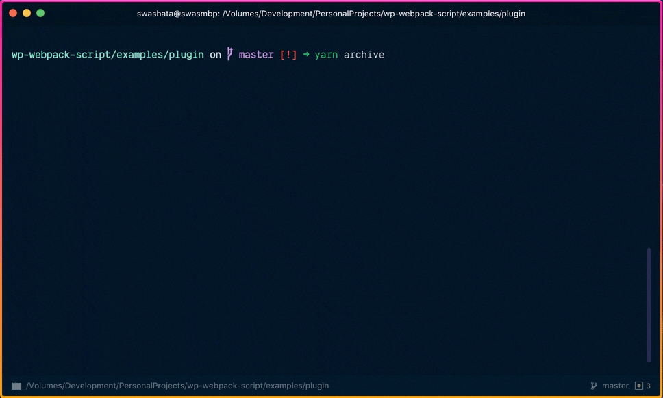

Now that you know how to start development server, it's time to create
production build. In most of the cases it is a single command away.

But if you want to create distributable `.zip` file for your WordPress theme
or plugin, then we have you covered too.

## Create production assets

From your terminal run

```bash
npm run build
```


This will create the production assets (`.js` and `.css` files along with any image files).

## Create distributable zip file

Now you may want to copy over the `dist` files, along with your PHP files
so that you can create a `.zip` out of it. It is needed when uploading themes
to WordPress too.

With `wpackio-scripts`, it's just a command away.

#### Mention files you want to copy

Edit your `wpackio.project.js` file to mention the files you want to copy
and where you want to copy.

```js
module.exports = {
	// Files that you want to copy to your ultimate theme/plugin package
	// Supports glob matching from minimatch
	// @link <https://github.com/isaacs/minimatch#usage>
	packageFiles: [
		'inc/**',
		'vendor/**',
		'dist/**',
		'*.php',
		'*.md',
		'readme.txt',
		'languages/**',
		'layouts/**',
		'LICENSE',
		'*.css',
		'!*.yml', // Don't copy any yml file from root
	],
	// Path to package directory, relative to the root
	packageDirPath: 'package',
};
```

The above config will copy the files matching the pattern in `packageFiles`
to `package` directory. So be sure to add it to your `.gitignore` file.

#### Run command

Now run the command from your terminal

```bash
npm run archive
```



This will produce the files for you to copy and deploy.

## Bonus: Deploy from Gitlab CI

We use [gitlab CI/CD](https://docs.gitlab.com/ee/ci/) within our workflow. And with `wpackio-scripts`, deploying
a theme or plugin is very easy. Our `.gitlab-ci.yml` file looks like this.

```yaml
# Our base image
image: registry.wpquark.io/wpq-develop/docker/wpunit:4.9.8

# Select what we should cache
cache:
  key: "$CI_COMMIT_REF_SLUG-$CI_JOB_NAME"
  paths:
  - vendor/
  - node_modules/

# Our stages
stages:
  - test
  - build
  - deploy

variables:
  WP_MULTISITE: "0"

# Test both javascript and PHP
test:
  stage: test
  tags:
    - wordpress
  before_script:
    # Install node dependencies
	- yarn install
	# Install composer dependencies
	- composer install
	# Build files
	- yarn build
    # Install WordPress PHPUnit Test
    - bash bin/install-wp-tests.sh wordpress_test admin mpass localhost $WP_VERSION
  script:
  - yarn test
  - composer run-script test

# Now we build on merging to master
build:
  stage: build
  tags:
    - wordpress
  before_script:
    # Install node dependencies
	- yarn install
	# Install composer dependencies
	- composer install
	# Build files
	- yarn build
  script:
	# Create distributable zip file
    - yarn archive
  artifacts:
    paths:
      - package/wp-fsqm-pro.zip
    expire_in: 1 week
  only:
    - master@wpq-develop/wp-fsqm-pro
    - tags

# And we do continuous deployment
deploy-staging:
  stage: deploy
  tags:
    - wordpress
  before_script:
    # Setup Environment variables to access keys & ssh agent
    - eval $(ssh-agent -s)
    - '[[ -f /.dockerenv ]] && echo -e "Host *\n\tStrictHostKeyChecking no\n\n" > ~/.ssh/config'
  script:
    # Make sure we add the Staging Key so that we can SSH
    - ssh-add <(echo "$WPQ_STAGING_KEY")
    # Delete and recreate the temporary directory for copying
    - ssh -p22800 fsqmpro@site.com "rm -rf ~/tmp_eform && mkdir -p ~/tmp_eform"
    # Copy the distribution ZIP
    - scp -P22800 package/wp-fsqm-pro.zip fsqmpro@site.com:~/tmp_eform
    # SSH and Delete the current plugin and unzip the new build
    - ssh -p22800 fsqmpro@site.com "rm -rf ~/public_html/wp-content/plugins/wp-fsqm-pro && unzip ~/tmp_eform/wp-fsqm-pro.zip -d ~/public_html/wp-content/plugins"
  environment:
    name: staging
    url: https://staging.eform.live/wp-admin/admin.php?page=ipt_fsqm_dashboard
  dependencies:
    - build
  only:
    - master@wpq-develop/wp-fsqm-pro
```
